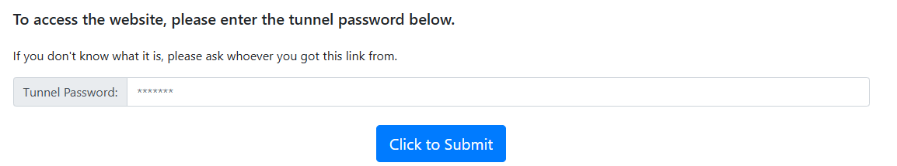

# RAG-QABot
Retrieval-Augmented Generation (RAG) Model for a Question Answering (QA) bot that interacts with financial data, specifically Profit &amp; Loss (P&amp;L) tables extracted from PDF documents.

This repository contains a system designed to process financial documents (e.g., P&L statements) and answer queries using a Retrieval-Augmented Generation (RAG) model. The project is divided into two main parts:

- Part 1: RAG Model-based QA Bot:
  - Located in the RAGModel folder.
  - Implements a Retrieval-Augmented Generation pipeline in RAGModel-QABot.ipynb.
- Part 2: Interactive QA Bot Interface:
  - Located in the QA-Bot folder.
  - Provides an interactive user interface using Streamlit for uploading financial PDFs and querying the extracted data.

### Part 1: RAG Model QA Bot
- Approach  
  The financial data is first loaded and preprocessed to extract meaningful information, such as tabular data from P&L statements. This preprocessing ensures that the data is structured and ready for embedding. Using a transformer-based Sentence Transformer model, the data is encoded into dense vector representations, capturing the semantic meaning of the financial content. These embeddings are then indexed in Pinecone, a high-performance vector database, allowing efficient storage and retrieval. Queries entered by users are similarly encoded into vectors and matched against the indexed data in Pinecone. The most relevant results are retrieved based on similarity scores, providing the context needed for generating accurate answers to user queries.
- Usage Instructions
  - Open RAGModel-QABot.ipynb in google collab.
  - Follow the steps to:
    - Upload the pdf file containing P&L data
    - Run all the parts.
    - Test the model by running example queries.
### Part 2: Interactive QA Bot Interface
- Approach
  - Frontend: 
    Built with Streamlit for uploading financial PDFs and querying. 
    Displays the extracted P&L data in a table format.
  - Backend: 
    Extracts data from uploaded PDFs (e.g., P&L tables) using tabula and pdfplumber.  
    Embeds data using Sentence Transformers and stores it in Pinecone.  
    Queries Pinecone and retrieves the most relevant rows from the document.
  - Deployment:  
    Deployed locally using Streamlit and exposed via localtunnel.
- Usage Instructions
  - Open streamlit_run.ipynb in google collab.
  - Upload frontend_qabot.py and backend_qabot.py
  - Install the libraries
  - Run the command - !wget -q -O - ipv4.icanhazip.com
  - copy the IP address
  - Run the command - !streamlit run frontend_qabot.py & npx localtunnel --port 8501
  - Click on 'your url'
  - Enter the copied IP address
    
  - Hence you will get the Interface of the QA BOT.
    
    
### Key Features
- Scalable Retrieval: Uses Pinecone to handle large datasets efficiently.
- Interactive Frontend: User-friendly interface for real-time queries.
- Dynamic Metadata Display: Extracted data is presented in a structured tabular format.
